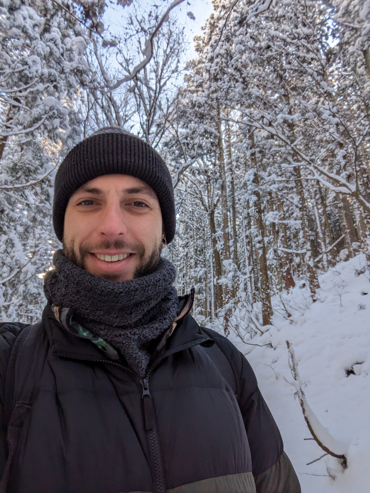

I am a machine learning researcher interested in improving data-driven methods applied to drug discovery.

My PhD was at The Institute of Cancer Research (ICR), supervised by Dr Nathan Brown and Prof. Julian Blagg using structural bioinformatics methods to characterise and compare protein binding sites. More recently I have helped build a state-of-the-art platform for supporting drug discovery at BenevolentAI where I was a technical scrum lead for two years, and the strategic AI Lead for Chemistry and Target Assessment.

I am interested in bringing the real-life problems of applying AI methods to drug discovery closer to the frontier of research, as I believe that the problems that are well-represented in research, are not those that are faced at the coal face of drug discovery. For me, semi-supervised learning, active learning/bayesian optimisation, explainable AI methods, and uncertainty quantification are some of the most pertinent directions for active ML research in the life sciences and I would also like to see improvements to our benchmarking approaches since many existing benchmarks are inadequate for measuring meaningful progress in the field.

Originally from *London*, I love working in buzzing teams of motivated, positively thinking, intelligent people. I'm not sure what else to write on a website, but feel free to check some of the links in the footer below as I'm sure this page will quickly go out of date...